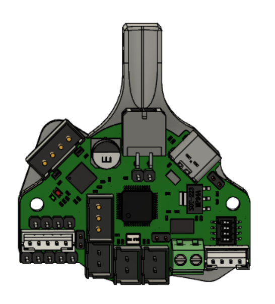
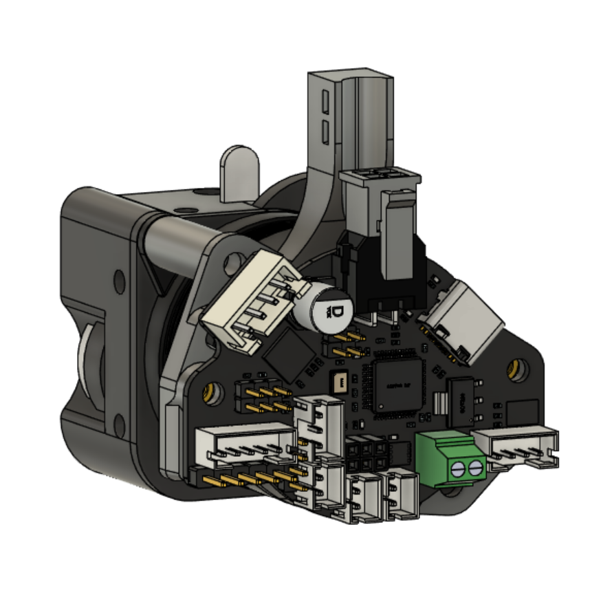
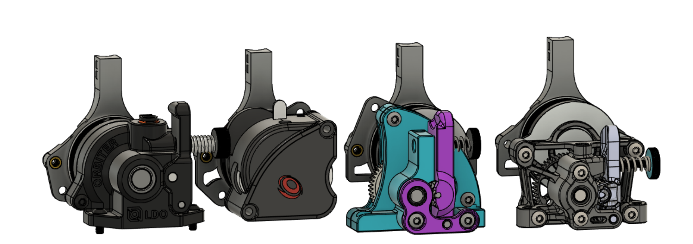
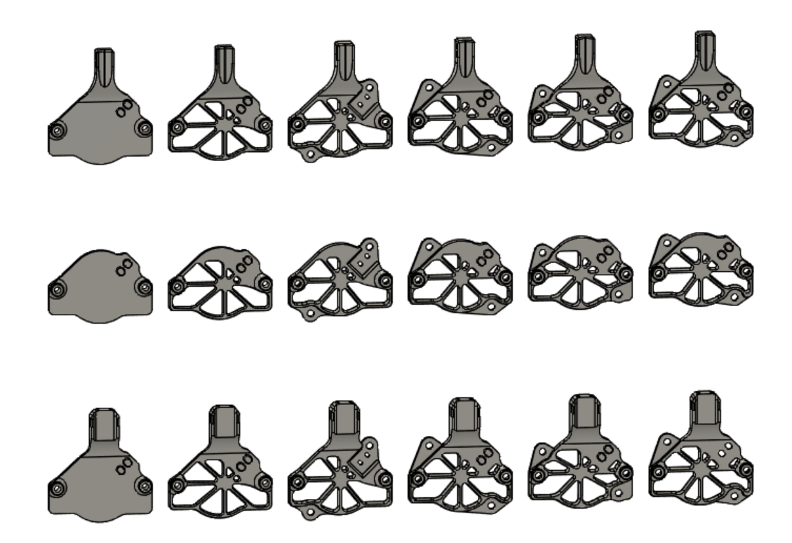
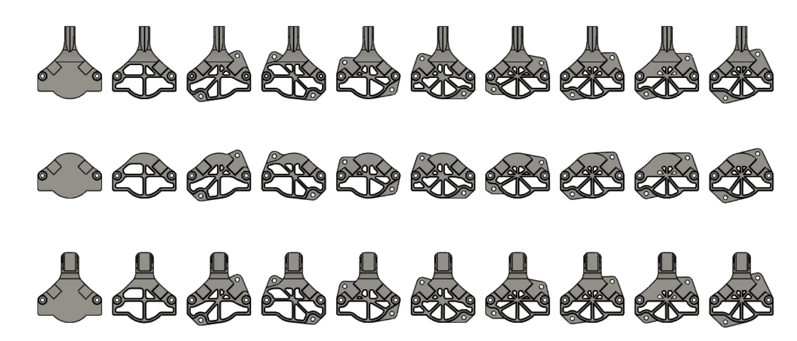
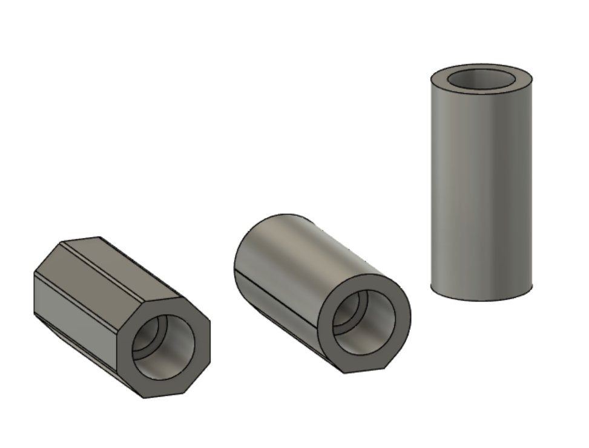

# Mounting Solutions for CANbus Toolhead Boards
Files are available to support the following boards:
* BTT EBB36 CAN v1.0(versions 1.1 and 1.2 are out, and have different molex placement.  The mounts for FLY SHT-36 *may* work with these boards, but I have not tested it or looked at things in CAD.  I'll be looking at this first thing, after MRRF)
* Mellow FLY SHT-36
 

## Extruder Compatibility
Since these boards have an on board ADXL345, it is important to mount them so that they are perpendicular to the axes of travel.  Klipper does not to my knowledge currently support input shaper tuning in other orientations.  These mounts allow the board to be oriented properly, despite the rotated motor.  I have found 5 different motor orientations among common NEMA 14 extruders in open source 3D printing.  If there's a common extruder with a different motor orientation that I missed, just message me on Discord.  The current files align with the motor orientation of the following extruders: 
* Sherpa Mini - Sherpa uses a straight 180 degree horizontal mounting for the motor.  This aligns with some toolheads with integrated extruders, though I have not tested fitment or looked for interference in CAD for any such toolhead.
* LGX Lite
* Sailfin
* Orbiter v1.5
* Orbiter v2.0.  

## Plate Types
There are 3 types of plates available: plain, strain relief, and overmold strain relief.  Each has a dedicated folder for the related stls.  The basic strain relief is for most diy cables.  The overmold strain relief is for retail cables available from Molex.  The plain brackets are for printers that have their own solution for umbilical or cable chains.

## Usage Notes
It seems as though the output for the stepper can be switched to the other side of the board if the user wanted it so.  The bracket base geometry has clearance for that in regular and mirrored orientation.  Not all extruder motor orientations allow this, but some do.

These plates are meant to work with mounting posts, similar to the strain relief on Voron v0.  The extruder motor gets mounted with screws that are 5mm longer than called for(so they protrude from the back).  Each end of the printed standoff post gets an M3 heatset insert.  Mounting post length should be chosen based on the motor you are using.  Measure the distance from the back of the motor to the back side of the mounting ears.  Add .5-1mm so the board mount isnt touching the motor, and print the corresponding post length from the folder.  The post is screwed onto the protruding motor mounting screw, and then the mounting bracket is screwed into the mounting posts.  Then you mount the board on the bracket.  The brackets with different board and motor screw orientations will require heatsets in the bracket, to mount the board.  Better documentation will be forthcoming.

## Usermods
Mod|Description|Link
|:--------:|:-------------------------:|:---:|
Reapola's Galileo Mounts|Mounts for rear or side of Galileo, with CAD|https://github.com/KayosMaker/CANboard_Mounts/tree/main/Usermods/Reapola/Galileo%20Mount%20for%20SHT36

There are 3 styles of standoff posts available.  They print in the orientation shown.  The classic round ones are fine as long as you print hot enough that layer adhesion is strong.  Geometry is in place to allow the internal overhang to print easily.  If that makes you uneasy, choose the octagonal or teardrop shapes and print them lying down as shown.  

