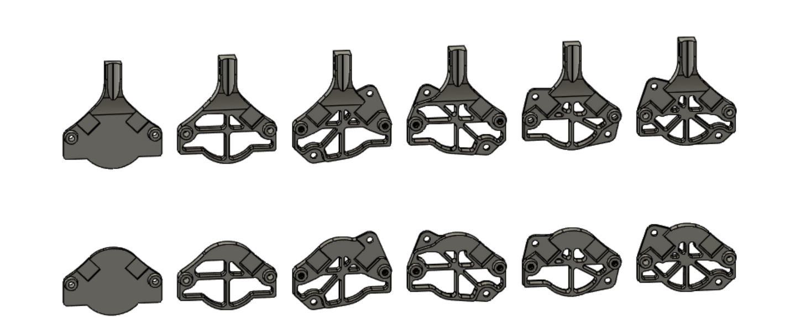
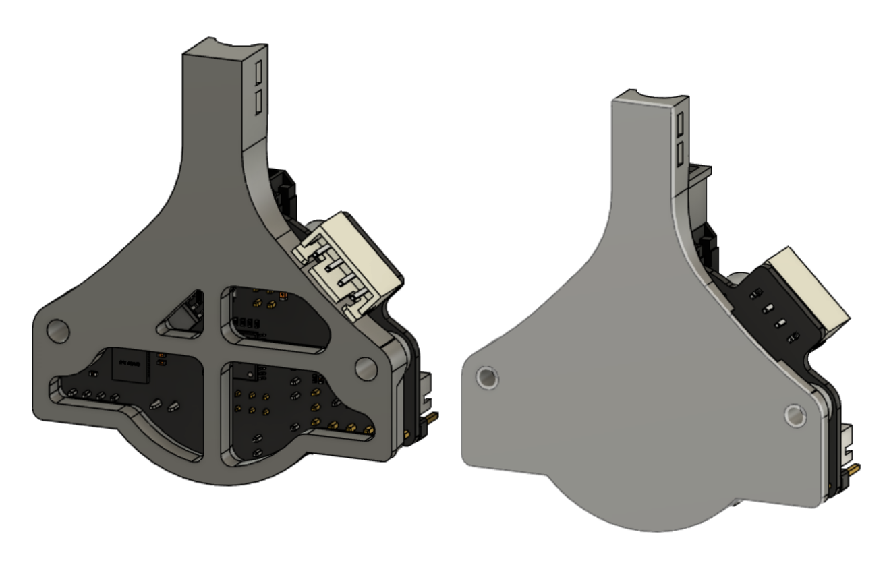
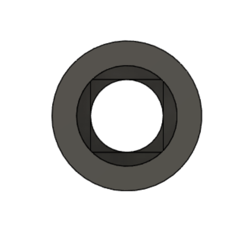

The current focus of this repo is the SHT-36 by Mellow.  Mounting lates are available that align with the motor orientation of the following extruders: Sherpa Mini, LGX Lite, Sailfin, and the LDO version of the Orbiter(old style orientation on the way).  Mini Afterburner should be able to utilize the Sherpa Mini plate.  The brackets for Sailfin and Orbiter will work if mirrored on X, to match mirrored extruders.  

It seems as though the output for the stepper can be switched to the other side of the board if the user wanted it so.  The bracket base has clearance for that.

These plates are meant to work with mounting posts, like the strain relief on Voron v0.  Each end of the post gets a heatset insert.  Mounting post length should be chosen based on the motor you are using.  Measure the distance from the back of the motor to the back side of the mounting ears.  Add .5-1mm so the board mount isnt touching the motor, and print the corresponding post length from the folder.  

There are 3 styles of post available.  They print in the orientation shown.  The classic round ones are fine as long as you print hot enough that layer adhesion is strong.  Geometry is in place to allow the internal overhang to print easily.  If that makes you uneasy, choose the hex or teardrop shapes and print them lying down as shown.  
  
