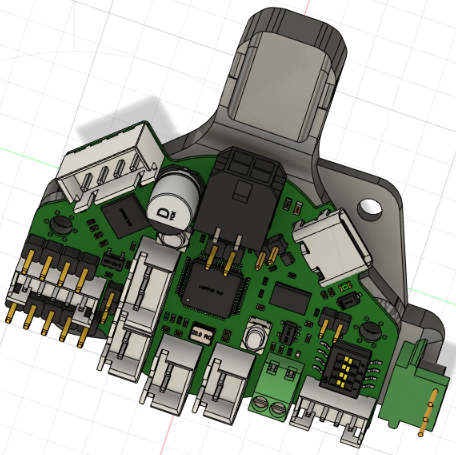
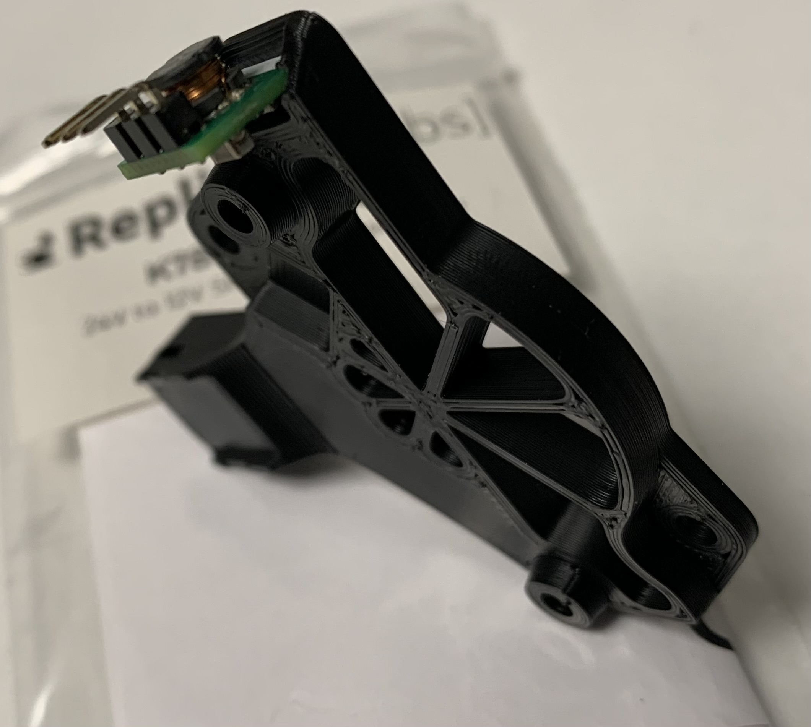

# Description
This mod additionally mounts the 24V-12V [K78L12-500R3](https://www.digikey.com/en/products/detail/mornsun-america-llc/K78L12-500R3/16784476) buck converter.
This is helpful when using e.g. 12V fans like Delta BFB0412HHA-A (12V) on your toolhead.

